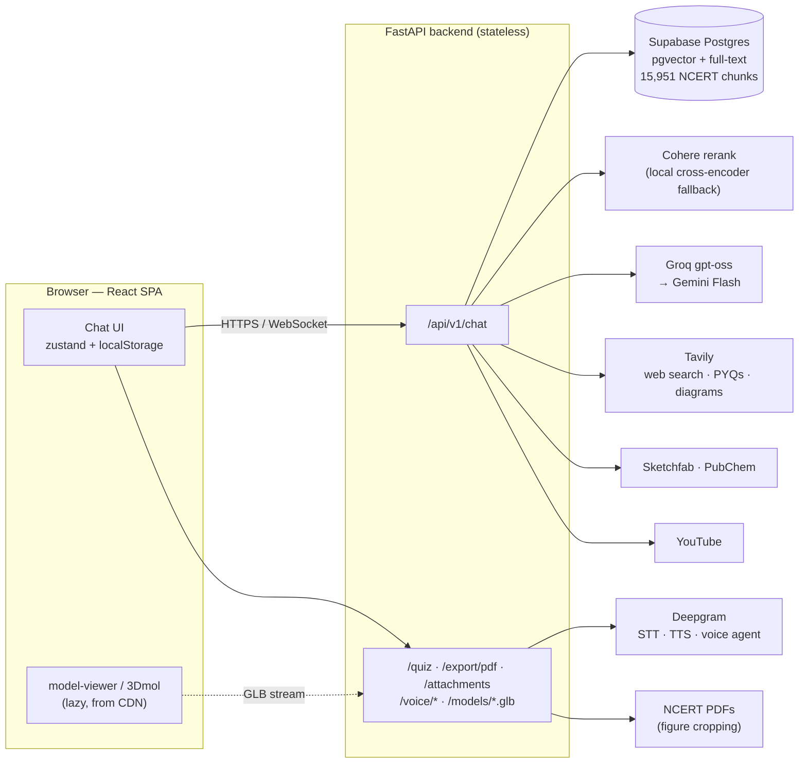
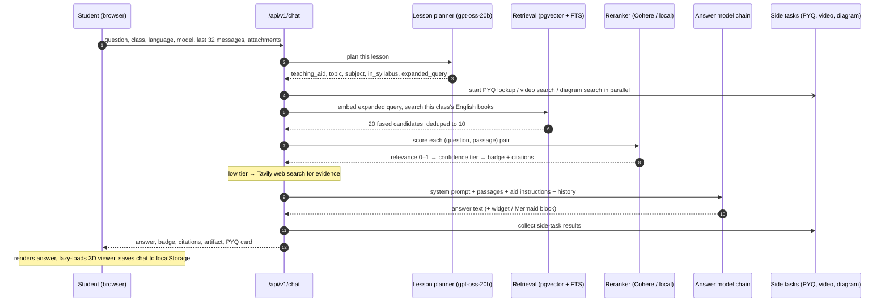
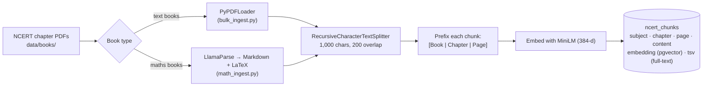

# RAGNOUS

**An AI tutor for Indian school students that answers from their own NCERT textbooks: Classes 8–10 Science and Social Science, plus Class 8 Mathematics.**

A student picks their class and asks a question by typing, speaking, or photographing a problem. RAGNOUS finds the passage in the student's own textbook that answers it, and teaches the answer in a fixed five-part structure. Every answer shows the book and page it came from, plus an honest badge saying how well the textbook supports it. Where it helps, the tutor adds a flowchart, a labelled 3D model, a molecule, a lesson video or a diagram. The student can then quiz themselves, see which topics have come up in past board exams, or export the conversation as a study-notes PDF with figures cropped from their own textbook.

| Measured on 103 questions ([full report](EVALUATION.md)) | |
|---|---|
| Finds the right chapter (top-1 / top-3) | **96.6% / 98.9%** |
| Answers fully correct (automated grader / stricter manual re-grade) | **92.3% / ~75%** |
| Answers correct or partially correct | **97.4%** |
| *NCERT verified* badge backed by the right chapter | **100%** |

> **Portfolio project.** There are no user accounts and no rate limits, and every model runs on a free tier. It serves roughly 40–50 questions a day before the quotas run out. Don't expose it publicly as it stands.

---

## Contents

1. [Features](#1-features)
2. [What makes it different](#2-what-makes-it-different)
3. [How it works, end to end](#3-how-it-works-end-to-end)
4. [The other pipelines](#4-the-other-pipelines)
5. [What the corpus covers](#5-what-the-corpus-covers)
6. [Measured accuracy](#6-measured-accuracy)
7. [Tech stack](#7-tech-stack)
8. [Engineering decisions worth calling out](#8-engineering-decisions-worth-calling-out)
9. [Known limitations](#9-known-limitations)
10. [Running it locally](#10-running-it-locally)
11. [Repository layout](#11-repository-layout)

---

## 1. Features

| Feature | What the student gets |
|---|---|
| **Tutor chat** | Answers written from the student's own class textbooks, with book + page citations and a confidence badge: *NCERT verified*, *Extended reference* or *AI knowledge*. |
| **Two model modes** | *Ragnous X1* for quick answers (Groq first) and *Ragnous Pro X1* for harder problems (Gemini first). |
| **Teaching aids** | For each question the tutor picks at most one aid: a Mermaid flowchart for processes, a labelled 3D model for spatial topics, a 3D molecule, a real diagram, or a YouTube lesson when the student is stuck. |
| **Attachments** | Photograph a problem, or attach a PDF, DOCX or text file. The tutor works through *that* page instead of lecturing on the chapter. |
| **Save as notes** | A PDF study module on the chat's topics, written fresh from the textbook, with figures cropped out of the NCERT PDF itself. |
| **Previous-year questions** | The first time a topic comes up, a card shows how it has appeared in past board exams, quoted from real papers. |
| **Quizzes & progress** | "Quiz me" builds a 5–6 question multiple-choice set across the topics discussed. Scores per topic feed a progress dashboard. |
| **Voice** | Dictate questions, have answers read aloud, or hold a spoken conversation with a live voice tutor that still answers from the textbooks. |
| **No account needed** | Class, preferences, chat history and quiz scores stay in the browser. The backend stores nothing about the student. |

## 2. What makes it different

- **It reads the student's actual books, and only the right ones.** Retrieval is limited to the books of the student's class. Only English-medium editions are searched, because the Hindi and Punjabi PDFs extract as broken text. The answer is still written in whatever language the student chose.
- **The confidence badge is honest.** A cross-encoder, not raw embedding similarity, decides whether a passage really answers the question. Raw similarity scored a question about quantum field theory higher than "state Ohm's law" on this corpus. Only passages that clear a relevance floor become citations, and anything below it is labelled *AI knowledge*. In the evaluation, 67 of 67 *NCERT verified* answers were backed by the right chapter.
- **One lesson planner, one teaching aid.** Before answering, a small model decides the single best way to teach this question. Its options are none, a flowchart, an image, a 3D model or a video. It also rewrites slang into formal NCERT terms ("ncp" → "Non-Cooperation Movement") and judges whether the topic is in the student's syllabus. Aids for topics outside the syllabus are refused.
- **Structured teaching, not a wall of text.** Every answer follows the same shape: direct answer → why it works → real-life grounding (Indian contexts) → worked example or analogy → common misconception → one "Try this" question. Depth adapts when the student is confused, wants more, or answered wrongly.
- **Labelled 3D models that are anatomically real.** Models come from a hand-vetted list of Sketchfab scans, labelled with NCERT part names. They are streamed through the backend without ever being stored. Molecules come from PubChem's 3D conformers. Colour appears only inside the model, where it carries meaning; the rest of the UI is strictly black and white.
- **Notes with the textbook's own figures.** The PDF export crops each figure out of the student's NCERT chapter by finding its caption. No web images.
- **Exam history quoted, not invented.** Previous-year questions are pulled from real exam pages as literal text, never paraphrased by an LLM.
- **A voice tutor that stays grounded.** The live voice agent calls back into the same retrieval pipeline for every academic question. The Deepgram key never leaves the server.
- **It keeps answering when a provider fails.** Answer generation walks an ordered chain of seven models across Groq and Gemini, and a photo forces the vision-capable branch.
- **It is measured.** A reproducible evaluation runs 103 questions through the live endpoint and publishes every question, answer and grade ([EVALUATION.md](EVALUATION.md)).

---

## 3. How it works, end to end

### 3.1 System overview



### 3.2 The life of one question

What happens between a student pressing Enter and the answer appearing:



1. **The browser sends the turn.** `useSendMessage` posts the question with the student's class, answer language, chosen model (X1 or Pro X1), the last 32 messages, any parsed attachments, and the list of topics that already showed an exam-history card (the backend keeps no session).
2. **The lesson planner decides how to teach.** A fast model (`gpt-oss-20b` on Groq) returns strict JSON with six fields:
   - the one teaching aid to use (`none`, `flowchart`, `image`, `3d` or `video`)
   - the formal NCERT topic
   - the subject
   - whether the student asked for notes
   - whether the topic is in their syllabus
   - an *expanded query*: the question with slang replaced by textbook terms
3. **Side tasks start in parallel**, so they overlap the main answer instead of adding to it:
   - the previous-year-question lookup (first time a topic is asked)
   - the YouTube search (when the student wants a video and the topic is in their syllabus)
   - a labelled-diagram search (when the aid is an image)
4. **Retrieval.** The expanded query is embedded with a local multilingual MiniLM model (384-d). A single SQL query runs two searches over the class's English-medium books: pgvector cosine similarity (top 40) and Postgres full-text search (top 40). They are fused with weighted Reciprocal Rank Fusion (vector 1.0, keyword 0.4) into 20 candidates. If the class's books return nothing, the search widens to all English-medium books. Near-duplicates are collapsed to 10.
5. **Rerank and confidence.** A cross-encoder scores each question–passage pair from 0 to 1. Cohere `rerank-english-v3.0` does this, falling back to a local `ms-marco-MiniLM-L-6-v2`, run off the event loop. The top score sets a tier:
   - high → *NCERT verified*
   - medium → *Extended reference*
   - low → *AI knowledge*

   Only passages above the relevance floor become citations. On a low tier, Tavily web search (advanced depth) supplies evidence instead.
6. **Prompt assembly.** The system prompt has five fixed sections:
   - **A:** source priority — textbook, then web, then a fixed refusal line
   - **B:** the five-part teaching structure
   - **C:** formatting
   - **D:** adaptive depth for confused, deeper or wrong-answer turns
   - **E:** non-negotiables, including the answer language

   The retrieved passages and the tier's mode instruction go into section A. Whichever aid the planner chose adds its own block: Mermaid rules for flowcharts, a 3D widget token, or a notes widget. Attached documents go before the question, so the model reads the page first.
7. **Generation.** The answer model chain runs in order until one responds (§7.4). Groq `gpt-oss-120b` goes first for X1, Gemini Flash first for Pro X1. A turn with an image goes only to Gemini, because the Groq models can't see.
8. **Post-processing.** The answer is scanned for structured blocks, and each is stripped from the visible text:
   - **3D widget token:** resolved to a model (§4.3) with NCERT part labels.
   - **Mermaid block:** becomes a flowchart artifact.
   - **Notes widget:** offers the PDF export.

   Then the video and PYQ side tasks are collected.
9. **Rendering.** The browser shows:
   - the answer, through its own markdown renderer
   - the badge and citations
   - the artifact; the 3D and molecule viewers (~2.5 MB) load from a CDN only the first time they're needed
   - the PYQ card

   The chat is saved to `localStorage`, and a speaker button can read the answer aloud.

A second implementation of the same flow as a LangGraph state machine lives at `/api/v1/chat/graph`: intent → retrieve → rerank → confidence router → synthesise → verify. The frontend uses the endpoint above.

---

## 4. The other pipelines

### 4.1 Ingestion (offline): PDFs → searchable chunks



One module, `services/embedding_service.py`, names the embedding model for both ingestion and querying. An earlier version embedded with a different model at ingest time, so none of those rows could ever be retrieved. `scripts/check_index.py` sanity-checks the result.

### 4.2 Save as notes → PDF

`POST /api/v1/export/pdf` does not summarise the chat. The chat is only used to pick **1–3 syllabus topics**. For each topic:
1. Retrieve English-medium passages for the student's class, and drop any the cross-encoder scores below a relevance floor. Vector search always returns *something*, and without the floor a "Volcanoes" request was once written from a history chapter.
2. Write the section from those passages, one section at a time, to stay under Groq's per-minute token limit. Gemini Flash is the fallback.
3. Find figures in the chapter PDF by their "Figure 6.3 …" captions and crop the drawing above each one with PyMuPDF. A crop may never overlap a paragraph. Crops are cached in `data/figures/`, and missing chapters are downloaded from `ncert.nic.in`.
4. Render with ReportLab. Symbols like → ≈ λ CO₂ go through a Unicode font so they don't print as black boxes.

The notes never name a chapter number. Sources are credited as "Class 8 Science (English), page 7".

### 4.3 3D models

The resolution order, in `services/model3d_service.py`:

1. A **hand-curated Sketchfab model** for the topic (heart, cell, eye, DNA …), with NCERT part labels.
2. A **Sketchfab search**.
3. A Sketchfab **embed**.
4. **Tripo3D** text-to-3D generation, as a last resort (currently off: its key returns 403).

Molecules come from **PubChem** 3D conformers and render with 3Dmol.js.

The mesh itself is never stored. The artifact carries RAGNOUS's own key, and `/api/v1/models/<key>.glb` fetches from Sketchfab on demand and streams it through with `Cache-Control: no-store`. Sketchfab's signed URLs die after 300 s, so storing them would break every saved chat. Sketchfab calls use `urllib`: Sketchfab fingerprints `httpx`'s TLS handshake and answers it with an empty `202`.

### 4.4 Quizzes and progress

`POST /api/v1/quiz/generate`:
1. Reads the recent chat and extracts the 1–3 topics actually discussed.
2. Optionally pulls real previous-year board questions per topic via Tavily.
3. Asks the model for a 5–6 question multiple-choice set spread across those topics, each question tagged with its topic.

The browser records every answer per topic, and the progress dashboard (Recharts) charts accuracy over time.

### 4.5 Previous-year questions

When a topic is asked for the first time, `services/pyq_service.py` searches the web (Tavily) for board papers and question banks and **parses the questions out as literal text**, with no LLM involved. That is for two reasons:
- An LLM "extracting" questions paraphrases them and borrows from neighbouring chapters.
- A 3–4k-token extraction call on every new topic used to exhaust the per-minute token budget and take down the actual answer.

### 4.6 Attachments

The paperclip posts files to `POST /api/v1/attachments` as soon as they're picked, so errors show up before the student hits send. `services/file_service.py` handles each type:
- **PDFs:** text is extracted; a PDF with too little text per page is treated as scanned, and the PDF itself goes to the vision model.
- **DOCX:** the paragraph text is read out of the document XML.
- **Plain text, CSV, JSON and similar:** read directly.
- **Photos:** re-encoded to at most ~1,568 px, since a vision model gains nothing above that.

Nothing is stored. The parsed result goes back to the browser and rides along with the next chat turn.

### 4.7 Voice

All three voice paths go through `app/api/v1/voice.py`, which holds the Deepgram key and checks each WebSocket's `Origin` itself. CORS doesn't cover WebSockets.

| Mode | Path |
|---|---|
| Dictation | `/voice/listen`: browser mic → backend → Deepgram streaming STT (`nova-2`) |
| Read aloud | `/voice/speak`: answer text → Deepgram Aura TTS |
| Live voice tutor | `/voice/agent`: a Deepgram Voice Agent. It listens with `flux-general-multi`, biased toward NCERT vocabulary; thinks with `gpt-4o-mini`; speaks with an ElevenLabs multilingual voice. For every academic question it calls a `query_knowledge_base` function, which the browser answers by running the full `/api/v1/chat` pipeline, so spoken answers are textbook-grounded too. |

### 4.8 Evaluation

`app/evaluation/accuracy_eval.py`:
1. Draws a random passage from every English-medium chapter.
2. Has a model write the question a student would ask about it, plus a reference answer and key points.
3. Sends each question through the live `/api/v1/chat` endpoint.
4. Grades each answer against its source passage with a model that isn't in the tutor's own chain.

`build_report.py` then renders [EVALUATION.md](EVALUATION.md) from the raw results. `eval_runner.py` is a separate, fast retrieval regression gate.

---

## 5. What the corpus covers

15,951 chunks in Supabase Postgres (`ncert_chunks`). Retrieval searches the English-medium editions only.

| Class | Books |
|---|---|
| 8 | Science *(Curiosity)*, Social Science *(Exploring Society: India and Beyond)*, Mathematics *(Ganita Prakash, Parts 1 & 2)*. Hindi and Punjabi editions of Science and Social Science are also ingested but not searched. |
| 9 | Science, Social Science *(Understanding Society: India and Beyond)* |
| 10 | Science, Contemporary India II, Understanding Economic Development, India and the Contemporary World II, Democratic Politics II |

**Not covered:** Mathematics for Classes 9–10, Classes 11–12, and the language books. Questions on those are answered from general knowledge and labelled *AI knowledge*.

## 6. Measured accuracy

Measured on 2026-09-25 against the live tutor endpoint with 88 student-style questions (one from a random passage in every English-medium chapter) plus 15 off-syllabus questions. Answers were graded by an independent model, and a sample was re-graded by hand. **Full method, every question and answer, and every failure: [EVALUATION.md](EVALUATION.md).**

| Metric | Result |
|---|---|
| Answer accuracy, fully correct (automated grader) | **92.3%** (72/78, 95% CI 84–96%) |
| Answer accuracy, fully correct (manual re-grade, stricter) | **~75%** (estimate, range 51–88%) |
| Answer accuracy, correct or partially correct | **97.4%** (76/78) |
| Top-1 retrieval: right chapter ranked first | **96.6%** (85/88) |
| Top-3 retrieval | **98.9%** (87/88) |
| Answer cites the chapter the question came from | **92.3%** (72/78) |
| *NCERT verified* badge backed by the right chapter | **100%** (67/67) |
| Median latency | 7.9 s |

The tutor almost always finds the right chapter and gets the core answer right. About one answer in five has a wrong detail in its explanation. The binding limit on this setup is **capacity**: 25 of the 103 questions got no answer because the Groq and Gemini free tiers ran out of daily quota. That also meant off-syllabus honesty couldn't be measured in this run.

---

## 7. Tech stack

### 7.1 Frontend — `/src`

React 18 + TypeScript (strict), built with Vite.

| Library | Used for |
|---|---|
| `react`, `react-dom` | UI runtime |
| `react-router-dom` | Routes: `/tutor` (also `/`), `/progress`, `/onboarding`, `/admin/observability` |
| `zustand` | Stores for chat, profile, progress, quiz, notes and UI, persisted to `localStorage` |
| `axios` + `fetch` | API calls (`src/api/`); the base URL comes from `VITE_API_URL` |
| `mermaid` | Flowchart artifacts inside answers |
| `recharts` | Progress dashboard charts |
| `lucide-react` | Stroke-only icons |
| `tailwindcss`, `postcss`, `autoprefixer` | Styling. The greyscale token set in `tailwind.config.js` is the whole design system. |
| `vite`, `@vitejs/plugin-react`, `typescript` | Build tooling |
| `<model-viewer>` 3.5 *(CDN, lazy)* | Labelled 3D models (GLB), with hotspots for part labels |
| `3Dmol.js` 2.1 *(CDN, lazy)* | 3D molecules from PubChem |

Answers render through a small hand-written markdown renderer (`components/chat/Markdown.tsx`), not a markdown library.

### 7.2 Backend — `/RAGNOUS-BACKEND`

Python 3.13 + FastAPI.

| Library | Used for |
|---|---|
| `fastapi`, `uvicorn[standard]`, `python-multipart` | HTTP API and file uploads |
| `websockets`, `httpx` | The Deepgram WebSocket relay and most upstream HTTP calls |
| `pydantic-settings`, `python-dotenv` | Configuration from `.env` |
| `langchain-core`, `langchain-groq`, `langchain-google-genai` | Model clients behind the ordered fallback chain (`services/llm_fallback.py`) |
| `langgraph` | The graph version of the tutor (`app/agents/`) |
| `sentence-transformers` | Local embeddings (MiniLM) and the local cross-encoder reranker |
| `cohere` | Hosted reranking |
| `asyncpg` | Every retrieval query against Postgres + pgvector |
| `tavily-python` | Web search: ungrounded answers, previous-year questions, diagram images |
| `pymupdf` | Finding and cropping figures in NCERT PDFs |
| `reportlab` | Rendering the notes PDF |
| `langchain-community`, `pypdf` | PDF loading in the ingestion scripts |
| `slowapi` | Rate-limit middleware (attached; no route sets a limit yet) |
| `celery`, `redis` | Background tasks in `app/workers/` (defined, not yet triggered by any endpoint) |
| `sqlalchemy`, `python-jose`, `passlib` | ORM models and JWT/password helpers kept for a future multi-user version; unused today |
| `langchain-openai` | Imported for NVIDIA-hosted models that are currently commented out |

The maths ingestion script also needs `llama-parse` and `nest_asyncio`, which are not in `requirements.txt` because the app never imports them. Sketchfab calls use the standard library's `urllib` (see §4.3).

### 7.3 External services

| Service | Used for |
|---|---|
| **Supabase** (Postgres + pgvector) | The chunk index. The free tier pauses after about a week idle; a paused project shows up as `tenant/user … not found`. |
| **Groq** | Lesson planner, answer model, quiz and notes writing |
| **Google Gemini** | Answer fallback, *Pro X1* primary, and vision for photos |
| **Cohere** | Reranking |
| **Tavily** | Web search, previous-year questions, diagram images |
| **Sketchfab** / **PubChem** | 3D models / 3D molecules |
| **Tripo3D** | Text-to-3D, last resort (key currently returns 403) |
| **YouTube** | Lesson videos (Data API when `YOUTUBE_API_KEY` is set, otherwise a results-page scrape) |
| **Deepgram** (+ ElevenLabs, OpenAI via the agent) | Speech-to-text, text-to-speech, live voice agent |
| **LlamaParse** | Parsing the maths PDFs at ingestion time |
| **NCERT** (`ncert.nic.in`) | Chapter PDFs for figure cropping |

### 7.4 Every model and what it does

| Role | Model |
|---|---|
| Embeddings (ingest + query) | `paraphrase-multilingual-MiniLM-L12-v2`, 384-d, local |
| Reranker | Cohere `rerank-english-v3.0` → local `cross-encoder/ms-marco-MiniLM-L-6-v2` |
| Lesson planner (intent) | Groq `gpt-oss-20b` → `qwen3-32b` → `gpt-oss-120b` |
| Answer, *X1* | Groq `gpt-oss-120b` → `qwen3-32b` → `kimi-k2-instruct` → `gpt-oss-20b` → Gemini 3.6 → 3.7 → 3.8 Flash |
| Answer, *Pro X1* | The same chain with Gemini first |
| Answer with a photo | Gemini Flash only (vision) |
| Voice agent | Deepgram `flux-general-multi` (listen) · OpenAI `gpt-4o-mini` (think) · ElevenLabs `eleven_multilingual_v2` (speak) |
| Evaluation writer and grader | Groq `qwen3.8-27b` (not in the tutor's chain) |

Every chain is configurable through environment variables such as `GROQ_ANSWER_MODELS` and `GEMINI_ANSWER_MODELS`.

---

## 8. Engineering decisions worth calling out

- **Retrieval reads English-medium books only.** Class 8 is also ingested in Hindi and Punjabi, but those PDFs extract as mangled ligatures, which make useless context. The tutor still replies in whatever language the student chose.
- **Confidence is judged on the reranker's scale, never raw cosine.** On the Class 10 Science corpus, "Explain quantum field theory renormalization" scores 0.56 cosine, enough to pass a naive threshold, while the cross-encoder gives the pair 0.0001. The *NCERT verified* badge therefore requires a rerank score.
- **Citations are earned, not decorative.** Only passages that clear the relevance floor are cited. Previously, the top three were cited even when the model had been told to ignore them, so web-sourced answers were attributed to NCERT chapters.
- **Nothing on the 3D path is cached to disk.** Meshes stream through with `Cache-Control: no-store`, and the artifact stores our own key rather than a signed URL that expires in 300 s.
- **Curated 3D models are vetted by hand.** A script scores candidates by whether their GLB actually carries textures, but a person adopts each one, because free 3D search returns "Moon Shoes" for *moon* and a Real Steel robot for *atom*.
- **Concurrency is deliberate.** The shared SentenceTransformer sits behind a lock, because concurrent encoding killed the process. Notes sections are written one at a time to stay under Groq's per-minute token budget. LangChain's own retry is off, because it slept through a 429 and looked like a 135-second hang.
- **The backend is stateless.** No chat, upload or profile is stored server-side. The browser holds the session and sends what each turn needs.

## 9. Known limitations

- **Free-tier capacity.** Groq allows each answer model 200,000 tokens a day and Gemini 20 requests per model per day, so these keys serve roughly 40–50 tutor questions a day before every model in the chain refuses (measured in [EVALUATION.md §8.1](EVALUATION.md#81-capacity-questions-the-tutor-could-not-answer)).
- **No authentication or rate limiting.** Fine for a demo, not for a public URL.
- **Maths isn't typeset in chat.** The tutor writes LaTeX (`$...$`), but the chat renderer has no maths engine, so formulas show as raw LaTeX. The notes PDF strips the delimiters.
- **Two of the four default Groq answer models no longer exist on Groq** (`qwen/qwen3-32b`, `moonshotai/kimi-k2-instruct`). A rate-limited request loses time on two dead hops before reaching `gpt-oss-20b`. Override the chain with `GROQ_ANSWER_MODELS`.
- **Class 10 is ingested twice** under two naming schemes, and about 5,700 chunk texts are stored more than once. Query-time dedup hides it from students, but it wastes index space and reranker slots.
- **274 chunks hold an LLM's chatter instead of textbook text** (e.g. "It seems that the provided text does not contain any mathematical formulas…"). They came from the LLM-assisted parse of the Class 8 Mathematics books, and three of its chapters yield no usable passage at all.
- **`/admin/observability` shows placeholder figures**, not live metrics.
- **Tripo3D text-to-3D is off.** The configured key returns `403`, and it is only the last-resort 3D source.
- **`tests/test_notes_service.py` has 7 stale tests** that patch attributes the notes service no longer reads. The other 44 tests pass.

---

## 10. Running it locally

```bash
# Frontend (Vite on :5173)
npm install
npm run dev
npm run build          # tsc -b && vite build

# Backend (FastAPI on :8000)
cd RAGNOUS-BACKEND
python -m venv venv && source venv/bin/activate
pip install -r requirements.txt
cp .env.example .env   # then fill in the keys
uvicorn app.main:app --reload
```

Point the frontend at a different backend with `VITE_API_URL` (default `http://127.0.0.1:8000/api/v1`). Never put secrets in a `VITE_` variable: they are compiled into the bundle.

Useful scripts, run from `RAGNOUS-BACKEND/`:

```bash
python -m scripts.bulk_ingest            # ingest NCERT PDFs into ncert_chunks
python -m scripts.math_ingest            # ingest maths PDFs via LlamaParse (pip install llama-parse nest_asyncio)
python -m scripts.check_index            # sanity-check the chunk index
python -m scripts.prewarm_figures        # crop NCERT figures into data/figures/
python -m app.evaluation.accuracy_eval   # end-to-end accuracy (see EVALUATION.md)
python -m app.evaluation.build_report    # regenerate EVALUATION.md from the results
python -m app.evaluation.eval_runner     # fast retrieval regression gate
python -m pytest -q tests
```

## 11. Repository layout

```
RAGNOUS/
├── EVALUATION.md              # measured accuracy report
├── src/                       # React + TypeScript frontend
│   ├── pages/                 # Tutor, ProgressDashboard, Onboarding, AdminObservability
│   ├── components/
│   │   ├── artifacts/         # artifact renderer, 3D model viewer, molecule viewer
│   │   ├── chat/              # chat window, composer, markdown, quiz, PYQ card, voice tutor
│   │   ├── layout/            # app shell, sidebar, logo
│   │   └── shared/ ui/        # skeletons, select
│   ├── api/                   # chat, quiz, attachments, client, config
│   ├── store/                 # zustand stores (chat, profile, progress, quiz, notes, ui)
│   └── hooks/ lib/ router/ types/
└── RAGNOUS-BACKEND/
    ├── app/
    │   ├── main.py            # FastAPI app + router mounting
    │   ├── api/v1/            # chat, graph_chat, attachments, export, notes_render,
    │   │                      # pdf_theme, quiz, voice, models
    │   ├── agents/            # LangGraph tutor: nodes + system prompt blocks
    │   ├── services/          # search, embedding, rerank, llm_fallback, notes,
    │   │                      # ncert_figure, model3d, pyq, youtube, file
    │   ├── evaluation/        # accuracy_eval, build_report, eval_runner, metrics + results
    │   └── memory/ knowledge_graph/ db/ core/ workers/
    ├── scripts/               # ingestion, index check, figure prewarm, 3D model curation
    ├── data/                  # NCERT PDFs and cropped figures
    ├── tests/
    └── docs/
```
